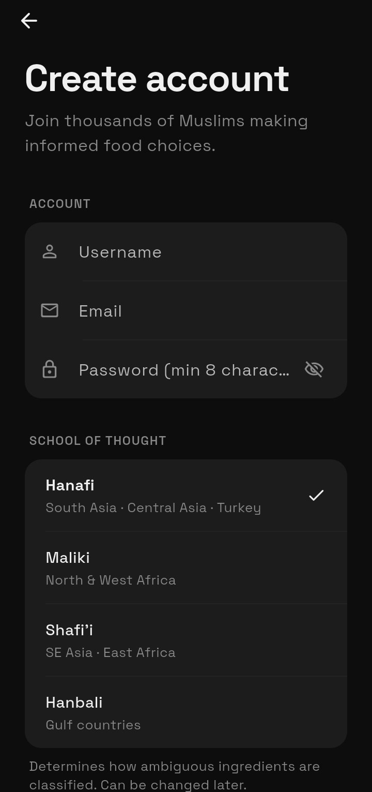
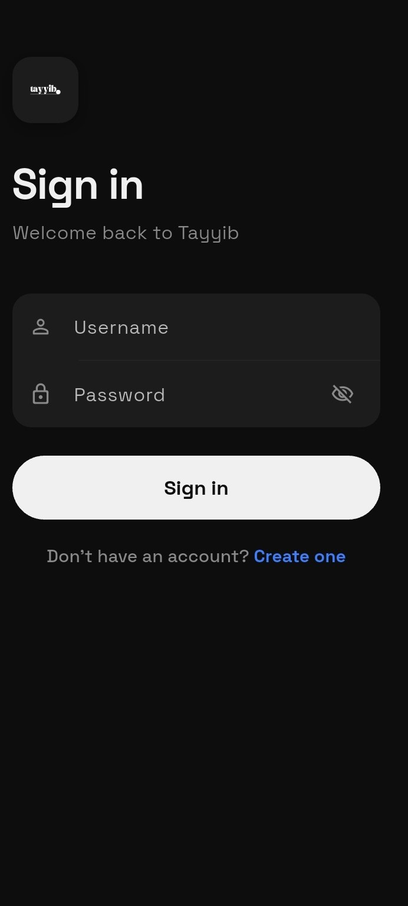
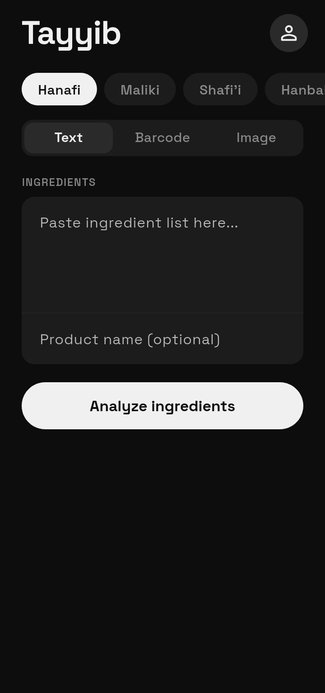
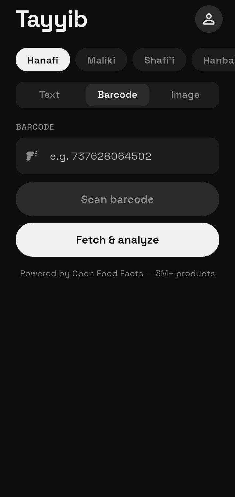
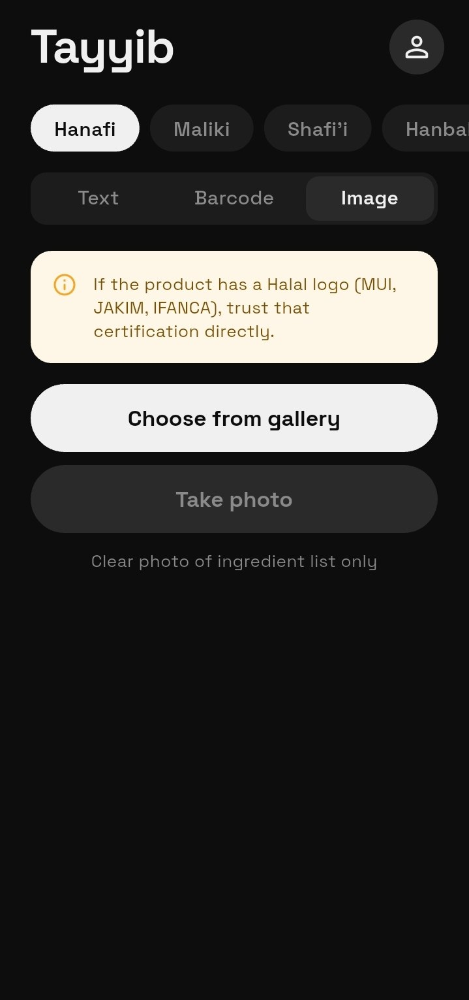
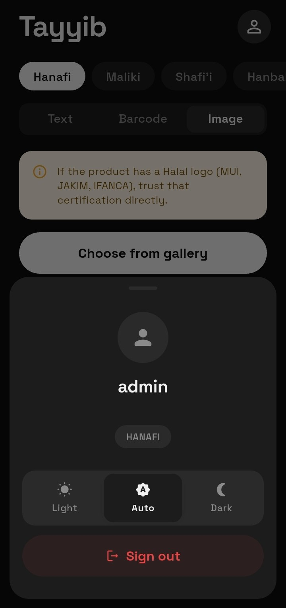

# Tayyib — Halal Ingredient Checker (Flutter Mobile App)

> **Is it Halal?** Instantly analyze food products using text, barcode, or photo — with full madhab-specific rulings.

**Tayyib** is the official mobile app for the Tayyib.io Halal checker platform. Built with Flutter, it provides a beautiful, fast, and consistent experience across iOS and Android.

**Companion Backend:** [tayyib.io](https://github.com/java-rakhmonaliev/tayyib.io)

---

## Features

### Core Analysis
- **Text Analysis** — Paste any ingredient list for instant classification
- **Barcode Scanner** — Real-time barcode scanning with Open Food Facts (3M+ products)
- **Photo Analysis** — Upload or take a photo of the label; AI extracts ingredients + detects halal logos

### Madhab Support
- Full support for **Hanafi, Maliki, Shafi'i, and Hanbali** rulings
- Easy madhab switcher in the app
- Automatic classification based on your selected school of thought

### Authentication
- JWT-based login and registration
- Profile management with madhab preference
- Dark / Light / Auto theme support

### UI/UX
- Modern dark-first design system
- Smooth animations and transitions
- Fully responsive and accessible

---

## Tech Stack

| Layer              | Technology                          |
|--------------------|-------------------------------------|
| Framework          | Flutter 3.x + Dart                  |
| State Management   | Provider / Riverpod                 |
| Barcode Scanning   | mobile_scanner                      |
| HTTP Client        | http + dio                          |
| Local Storage      | shared_preferences                  |
| Theming            | Custom TayyibTheme (Space Grotesk)  |
| Backend            | Django REST Framework + JWT         |

---

## Screenshots
| Sign In | Create Account | Text Analysis |
|---------|----------------|---------------|
|  |  |  |

| Barcode | Image Analysis | Profile |
|---------|----------------|---------|
|  |  |  |

---

## Getting Started (Development)

### Prerequisites
- Flutter SDK 3.0+
- Dart 3.0+
- Android Studio / Xcode
- Backend running at `http://13.217.178.63`

### Setup

```bash
git clone https://github.com/java-rakhmonaliev/tayyib-app.git
cd tayyib-app

flutter pub get
flutter run
```

---

## Design System

The app uses a custom design system called **TayyibTheme**:
- Font: Space Grotesk
- Primary color: `#2DB87A` (Halal Green)
- Error color: `#E84545` (Haram Red)
- Warning color: `#F5A623` (Questionable Orange)
- Dark mode-first approach

The **web interface** (tayyib.io) was built to match this exact design system.

---

## License

MIT License © 2026 Javokhirbek Rakhmonaliev

---

**Built with Flutter + Django + Groq AI** — for the Ummah.

*Last updated: May 2026*
